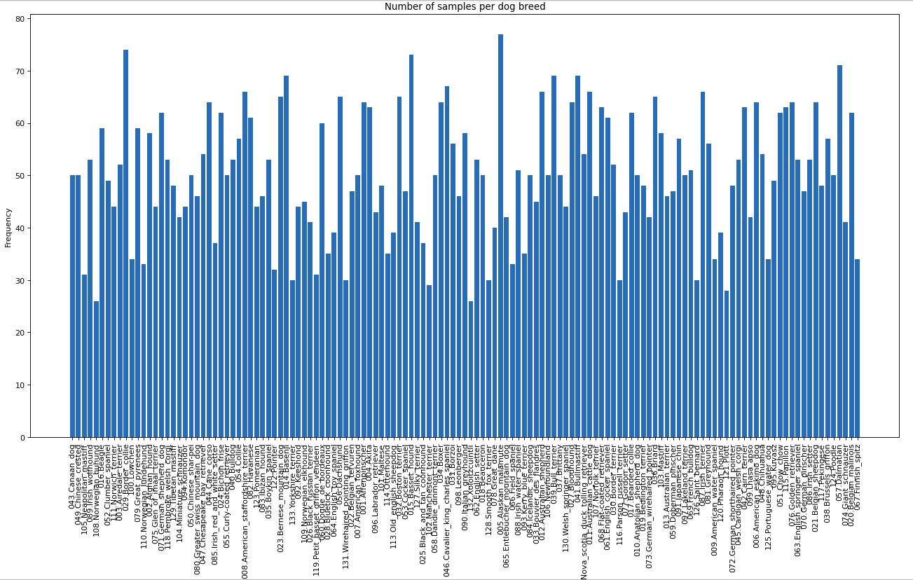
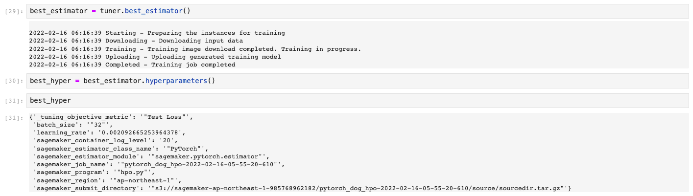

# Image Classification using AWS SageMaker

This project shows how to use AWS Sagemaker to train a pretrained model that can perform image classification by using the Sagemaker profiling, debugger, and hyperparameter tuning. 

# Dataset
As a POC we are working on a dog breed datset, which contains images of dogs categorized into 133 breeds.

## Project Set Up and Installation
To make use of this set up is necessary to open a notebook instance in Sagemaker and upload the dataset on a S3 bucket. The notebook instance needs to have access to the bucket.

## Hyperparameter Tuning
The model model tuned in order to give a better performanced, namely in terms of batch size and learning rates.

## Debugging and Profiling
**TODO**: Give an overview of how you performed model debugging and profiling in Sagemaker

### Results
**TODO**: What are the results/insights did you get by profiling/debugging your model?

**TODO** Remember to provide the profiler html/pdf file in your submission.

## Model Deployment
**TODO**: Give an overview of the deployed model and instructions on how to query the endpoint with a sample input.

**TODO** Remember to provide a screenshot of the deployed active endpoint in Sagemaker.

