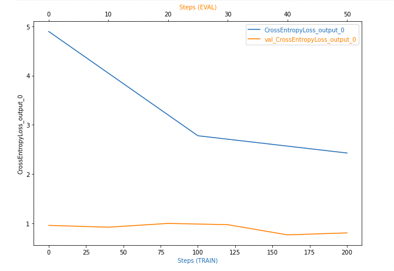
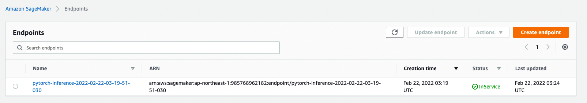
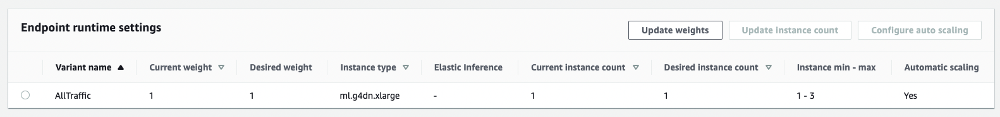
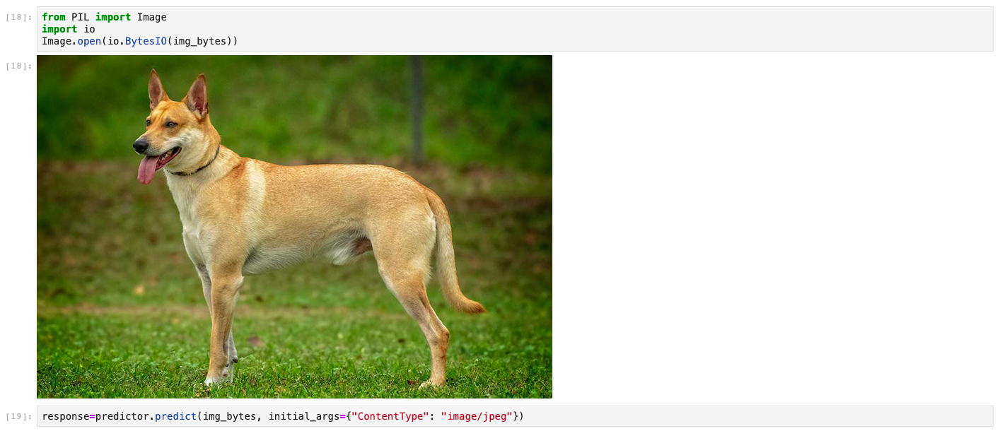

# Image Classification using AWS SageMaker

This project shows how to use AWS Sagemaker to train a pretrained model that can perform image classification by using the Sagemaker profiling, debugger, and hyperparameter tuning. 

# Dataset
As a POC we are working on a dog breed datset, which contains images of dogs categorized into 133 breeds.

## Project Set Up and Installation
To make use of this set up is necessary to open a notebook instance in Sagemaker and upload the dataset on a S3 bucket. The notebook instance needs to have access to the bucket.

## Hyperparameter Tuning
The model model tuned in order to give a better performanced, namely in terms of batch size and learning rates.

## Debugging and Profiling
There doesn't seem to be any anomalous behavior observed

The full report can be seen in the folder 'ProfilerReport'

## Model Deployment
The model was deployed using ml.g4dn.xlarge using autocale as shown in the figures below

To query the model you need to pass the image was shown in the figures below

